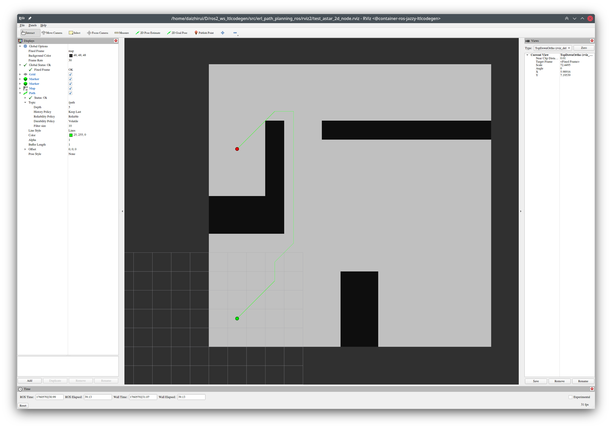
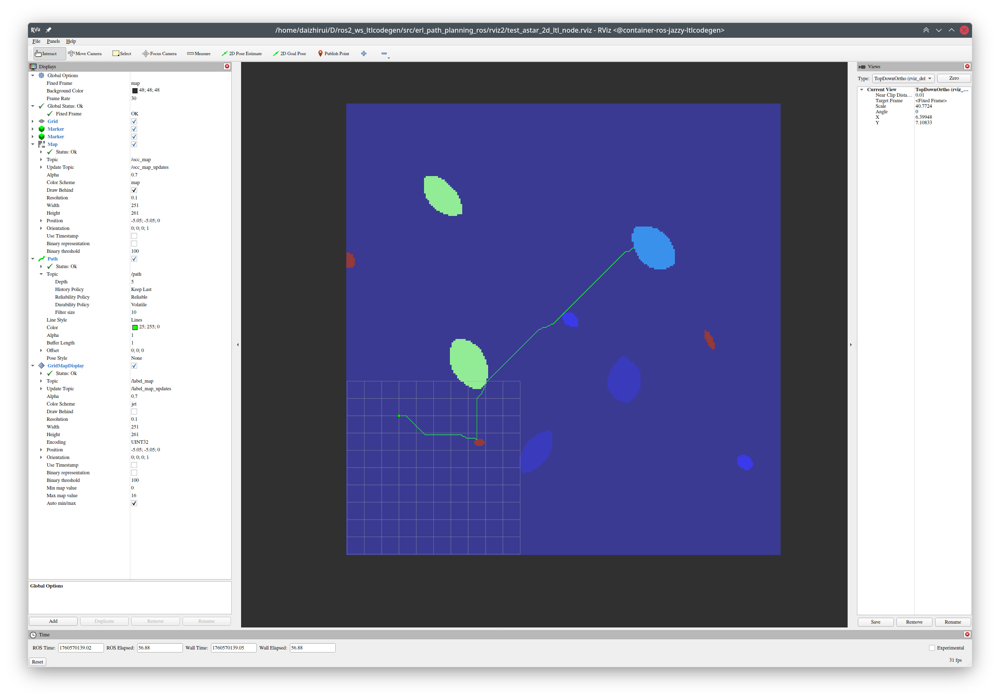

# `erl_path_planning_ros`


[](https://github.com/ExistentialRobotics/erl_path_planning_ros/tags)
[](https://opensource.org/licenses/MIT)
[](https://docs.ros.org/)
[](https://docs.ros.org/)
<!-- [](http://wiki.ros.org/) -->


This package provides ROS nodes that wrap the `erl_path_planning` library for use in robotics
applications. It includes support for both standard 2D path planning and Linear Temporal
Logic (LTL) based path planning for mission specification.

| A* 2D                                     | A* 2D with LTL                                |
| ----------------------------------------- | --------------------------------------------- |
|  |  |

## Features

- **A\* Path Planning**: Optimal path planning using the A* algorithm
- **LTL Mission Planning**: Support for complex mission specifications using Linear Temporal Logic
- **ROS2 Integration**: Full integration with ROS2 interfaces
- **Flexible Precision**: Supports both single and double precision computation
- **Configurable Motion Primitives**: Customizable grid-based motion with diagonal movements
- **Robot Footprint Support**: Considers robot geometry for collision checking
- **QoS Configuration**: Flexible QoS settings for all topics

## Nodes

### Common Parameters for A\* Based Nodes

All A\* nodes inherit from a common base class (`AstarNode`) that provides the following shared parameters:

#### Core Settings
- `double_precision` (bool, default: false): Use double precision instead of float
- `global_frame` (string, default: "map"): Global reference frame
- `robot_frame` (string, default: "base_link"): Robot reference frame
- `start_source` (string, default: "topic"): Start source ("topic" or "tf")

#### Default QoS Settings
- `default_qos_reliability` (string, default: "best_effort"): Default QoS reliability for topics
- `default_qos_durability` (string, default: "transient_local"): Default QoS durability for topics

#### Input Topics
- `start_topic` (string, default: "start"): Start pose topic
- `start_topic_qos_reliability` (string, default: uses default_qos_reliability)
- `start_topic_qos_durability` (string, default: uses default_qos_durability)
- `goal_topic` (string, default: "goals"): Goal positions topic
- `goal_topic_qos_reliability` (string, default: uses default_qos_reliability)
- `goal_topic_qos_durability` (string, default: uses default_qos_durability)
- `goal_tolerance_topic` (string, default: "goal_tolerances"): Goal tolerances topic
- `goal_tolerance_topic_qos_reliability` (string, default: uses default_qos_reliability)
- `goal_tolerance_topic_qos_durability` (string, default: uses default_qos_durability)
- `terminal_cost_topic` (string, default: "terminal_costs"): Terminal costs topic
- `terminal_cost_topic_qos_reliability` (string, default: uses default_qos_reliability)
- `terminal_cost_topic_qos_durability` (string, default: uses default_qos_durability)

#### Output Topics
- `path_topic` (string, default: "plan"): Path output topic
- `path_topic_qos_reliability` (string, default: uses default_qos_reliability)
- `path_topic_qos_durability` (string, default: uses default_qos_durability)
- `cost_topic` (string, default: "cost"): Cost output topic
- `cost_topic_qos_reliability` (string, default: uses default_qos_reliability)
- `cost_topic_qos_durability` (string, default: uses default_qos_durability)
- `goal_idx_topic` (string, default: "goal_idx"): Goal index output topic
- `goal_idx_topic_qos_reliability` (string, default: uses default_qos_reliability)
- `goal_idx_topic_qos_durability` (string, default: uses default_qos_durability)

#### Services
- `plan_srv_name` (string, default: "plan"): Planning service name
- `reset_srv_name` (string, default: "reset"): Reset service name

#### A\* Algorithm Settings
- `eps` (double, default: 1.0): Suboptimality factor (1.0 = optimal, >1.0 = faster but suboptimal)
- `max_num_iterations` (int, default: 100000): Maximum number of search iterations
- `log` (bool, default: false): Enable verbose logging
- `reopen_inconsistent` (bool, default: false): Reopen inconsistent nodes in search

---

### 1. astar_2d_node

Standard 2D A* path planner for grid-based navigation.

#### Subscriptions

- `map` (nav_msgs/OccupancyGrid): Occupancy grid map for planning (default topic: "map")
- `start` (std_msgs/Float64MultiArray): Start position as (x, y) vector (default topic: "start")
- `goals` (std_msgs/Float64MultiArray): Goal positions as (2, N) matrix (default topic: "goals")
- `goal_tolerances` (std_msgs/Float64MultiArray): Goal tolerances (default topic: "goal_tolerances")
- `terminal_costs` (std_msgs/Float64MultiArray): Terminal costs for each goal (default topic: "terminal_costs")

#### Publications

- `plan` (nav_msgs/Path): Computed path from start to goal
- `cost` (std_msgs/Float64): Total cost of the computed path
- `goal_idx` (std_msgs/Int64): Index of the reached goal

#### Services

- `plan` (std_srvs/srv/Trigger): Trigger path planning
- `reset` (std_srvs/srv/Trigger): Reset the planner state

#### Parameters

See [Common Parameters for A\* Based Nodes](#common-parameters-for-a-based-nodes) above.

**Additional Node-Specific Parameters:**

*Map Configuration:*
- `map_topic` (string, default: "map"): Occupancy grid topic
- `map_topic_qos_reliability` (string, default: "best_effort"): QoS reliability setting
- `map_topic_qos_durability` (string, default: "transient_local"): QoS durability setting

*Motion Primitives:*
- `max_axis_step` (int, default: 1): Maximum step along one axis for motion primitives
- `allow_diagonal` (bool, default: true): Allow diagonal movements

*Robot Configuration:*
- `robot_metric_contour` (double[], default: []): Robot footprint contour as [x1, y1, x2, y2, ...] (minimum 3 points)

*Environment Settings:*
- `obstacle_threshold` (int, default: varies): Occupancy threshold for obstacles (0-100)
- `add_map_cost` (bool, default: false): Add map costs to path cost
- `map_cost_factor` (double, default: 0.0): Factor to scale map costs

### 2. astar_2d_ltl_node

A* path planner with Linear Temporal Logic (LTL) mission specification support.

#### Subscriptions

- `occ_map` (nav_msgs/OccupancyGrid): Occupancy grid map (default topic: "occ_map")
- `label_map` (erl_geometry_msgs/GridMapMsg): Label map (UINT32) for atomic propositions (default topic: "label_map")
- `fsa_spot` (std_msgs/String): Finite State Automaton in Spot HOA format (default topic: "fsa_spot")
- `start` (std_msgs/Float64MultiArray): Start position (default topic: "start")
- `goals` (std_msgs/Float64MultiArray): Goal positions (default topic: "goals")
- `goal_tolerances` (std_msgs/Float64MultiArray): Goal tolerances (default topic: "goal_tolerances")
- `terminal_costs` (std_msgs/Float64MultiArray): Terminal costs (default topic: "terminal_costs")

#### Publications

- `plan` (nav_msgs/Path): Computed path satisfying LTL specification
- `cost` (std_msgs/Float64): Total cost of the computed path
- `goal_idx` (std_msgs/Int64): Index of the reached goal
- `ap_dict` (std_msgs/String): Atomic proposition dictionary in YAML format

#### Services

- `plan` (std_srvs/srv/Trigger): Trigger LTL-aware path planning
- `reset` (std_srvs/srv/Trigger): Reset the planner state

#### Parameters

See [Common Parameters for A\* Based Nodes](#common-parameters-for-a-based-nodes) above.

**Additional LTL-Specific Topics:**
- `label_map_topic` (string, default: "label_map"): Label map topic
- `label_map_topic_qos_reliability` (string, default: "best_effort")
- `label_map_topic_qos_durability` (string, default: "transient_local")
- `occ_map_topic` (string, default: "occ_map"): Occupancy map topic
- `occ_map_topic_qos_reliability` (string, default: "best_effort")
- `occ_map_topic_qos_durability` (string, default: "transient_local")
- `fsa_topic` (string, default: "fsa_spot"): FSA topic in Spot HOA format
- `fsa_topic_qos_reliability` (string, default: "reliable")
- `fsa_topic_qos_durability` (string, default: "transient_local")
- `ap_dict_topic` (string, default: "ap_dict"): Atomic proposition dictionary output topic

**Note:** The `astar_2d_ltl_node` does not use the `map_topic` parameter. Instead, it uses `occ_map_topic` and `label_map_topic` for separate occupancy and label information.

## Usage Examples

### Basic 2D Planning

```bash
# Launch with default parameters
ros2 run erl_path_planning_ros astar_2d_node

# Launch with custom parameters
ros2 run erl_path_planning_ros astar_2d_node --ros-args \
  -p double_precision:=true \
  -p global_frame:=map \
  -p eps:=1.5 \
  -p max_axis_step:=2 \
  -p allow_diagonal:=true \
  -p robot_metric_contour:="[-0.3, -0.3, 0.3, -0.3, 0.3, 0.3, -0.3, 0.3]"

# Publish start and goals
ros2 topic pub /start std_msgs/msg/Float64MultiArray \
  "{layout: {dim: [{size: 2, stride: 1}]}, data: [0.0, 0.0]}"

ros2 topic pub /goals std_msgs/msg/Float64MultiArray \
  "{layout: {dim: [{size: 2, stride: 1}, {size: 1, stride: 1}]}, data: [5.0, 5.0]}"

# Trigger planning
ros2 service call /plan std_srvs/srv/Trigger
```

### LTL-Based Planning

```bash
# Launch LTL planner
ros2 run erl_path_planning_ros astar_2d_ltl_node --ros-args \
  -p double_precision:=false \
  -p eps:=1.0 \
  -p max_num_iterations:=200000

# The node will wait for:
# - Occupancy map on /occ_map
# - Label map on /label_map
# - FSA specification on /fsa_spot
# Then publish the atomic proposition dictionary on /ap_dict

# Trigger planning
ros2 service call /plan std_srvs/srv/Trigger
```

## Dependencies

- `erl_path_planning`: Core path planning algorithms
- `erl_env`: Environment representations
- `erl_geometry_msgs`: Provides `GridMapMsg`
- `erl_common`: Common utilities
- ROS1 Noetic (TODO)
- ROS2 Humble or later

## Building

### ROS2

```bash
# In your ROS2 workspace
colcon build --packages-select erl_path_planning_ros
```
